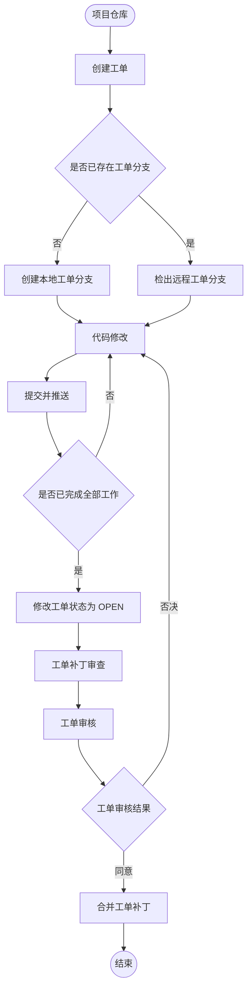

# Gitblit Cookbook

## Tickets 工单

### 流程图



### 1. 创建标准工单

#### 1.1.  UI 图形用户界面

可以使用Web用户界面创建标准工单

##### 1.1.1. 进入仓库主页点击`新建`按钮

   

###### 1.1.2. 填写工单详情

工单字段说明
​	

- **标题**：简要工作内容

- **主题**：topic 话题、标签或类别，相当于工单的分类，可为空

- **描述**：详细的工作内容

- **类型**：
  - enhancement - 增强；提高；增加
  - task - 任务、需求
  - bug - 错误、漏洞
  - question - 问题
  - maintenance - 维护

- **severity** - 严重等级
  - unrated - 未分级的
  - negligible - 不重要的
  - minor - 次要的
  - serious - 严重的
  - critical - 关键的
  - catastrophic - 灾难性的


​	**以下选项是拥有推送（RW）权限的用户才会显示**

- **priority** - 优先级
  - urgent - 加急
  - high - 紧急
  - normal - 一般
  - low - 次要

- **负责人** - 项目中拥有推送权限的用户，可以不指定

- **合并到** - 选择`工单`完结后需要合并到的分支，例如 `dev` / `master`

###### 1.1.3. 工单信息


####  1.2. CLI 命令行界面


### 2. 管理工单
可在`项目`-`工单`页面中`查询`/`编辑`/`删除`历史工单


### 3. 创建工单补丁集
#### 3.1. 创建工单本地分支

分支名格式为 `ticket/{id}`，`id` 为需要关联的工单ID

例如：`ticket/2` 分支关联工单2，以下示例已工单2举例

##### 3.1.1. **使用 SourceTree (图形用户界面)**

1. 从远程仓库中获取所有分支


2. 检查是否远程中是否已存在分支 `ticket/2`
   - 存在 - 直接选中右键检出
   - 不存在 - 继续后续的第 3 点操作


3. 新建分支 `ticket/2`


4. 提交修改到分支 `ticket/2`

5. 新增工单补丁集（将分支 `ticket/2` 的提交推送到远程仓库）


   **只有以下用户可以推送工单分支：**
   - 工单作者
   - 初始化工单补丁集作者
   - 工单制定的负责人
   - 对仓库具有推送（RW）权限的用户

   **否则推送会报错**


##### 3.1.2. 使用 CLI (命令行界面)

```bash
# 获取所有分支最新提交 &&  以 dev 分支为起点创建 ticket/{id} 分支
git fetch && git checkout ticket/{id} dev

# 修改提交...

# 推送分支
git git push -u origin ticket/{id}

```

#### 3.2.  查询工单提交记录

在工单页面可以查看所有提交记录


#### 3.3. 工单完成

将工单状态修改为 `open`


### 4. 审查工单

####  4.1. 检查修订内容


####  4.2. 修订审核

   工单通过则选择 `同意 +2` 选项，否则选择 `否决 -2` 选项。


   ::: warning
   - 拥有仓库 `RW(推送)` 权限以上的用户才会出现 `同意` 和 `否决` 按钮。
   - 如果工单补丁集被更新或重写，所有以前的审查分数都将被忽略。
   :::

####  4.3. 评论


### 5. 合并工单补丁

#### 5.1. 自动合并

工单页面中的 `合并` 按钮，可自动合并工单补丁。但满足以下所有条件时，才会显示，否则需要手动合并

- 修订评分至少有一个 `+2` 且没有 ` -2` 
- 补丁修改不存在冲突


::: tip
当进行工单自动合并操作后，工单状态变为 `MERGED`， 后续将无法再次推送提交到对应工单分支，需要新建工单。
:::

#### 5.2. 手动合并

工单补丁无法自动合并时，则需要手动合并。


以下示例为，使用命令行合并`工单2`补丁：

1. 以 `dev`  分支为起点，新建本地分支 `patch-2`。

   ``` bash
   git checkout -b patch-2 dev
   ```

2. 拉取工单2分支 `ticket/2` 的提交修改到当前分支 `patch-2`。

   ```bash
   git pull origin ticket/2
   ```

3. 若存在冲突，则解决冲突，然后提交修改。

4. 切换到 `dev` 分支，合并 `patch-2` 分支到 `dev` 分支，推送修改。

5. 删除本地分支 `patch-2`。

   ```bash	
   git branch -d patch-2
   ```

6. 将工单2状态修改为 `FIXED`。

   

7. 完成。

::: tip
当工单状态不为 `MERGED` 时，若再次推送提交到工单分支，则工单状态会重置为 `OPEN`。并且新的提交被归为新的补丁集，可以再次合并。
:::

### 6. 仓库设置
#### 6.1 用户权限设置

   - 需要审查代码的用户：R(克隆） 权限
   - 可以审批和推送代码的用户：RW(推送) 权限

   

#### 6.2. 工单设置
   

>有关详细信息，请参阅:
>[Using Tickets (Gitblit)](https://www.gitblit.com/tickets_using.html)